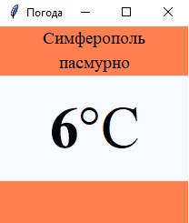
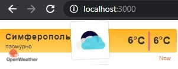

<p align="center">МИНИСТЕРСТВО НАУКИ  И ВЫСШЕГО ОБРАЗОВАНИЯ РОССИЙСКОЙ ФЕДЕРАЦИИ<br>
Федеральное государственное автономное образовательное учреждение высшего образования<br>
"КРЫМСКИЙ ФЕДЕРАЛЬНЫЙ УНИВЕРСИТЕТ им. В. И. ВЕРНАДСКОГО"<br>
ФИЗИКО-ТЕХНИЧЕСКИЙ ИНСТИТУТ<br>
Кафедра компьютерной инженерии и моделирования</p>
<br>
<h3 align="center">Отчёт по лабораторной работе № 1<br> по дисциплине "Программирование"</h3>
<br><br>
<p>студента 1 курса группы ИВТ-б-о-202(1)<br>
Емельянович Карина Руслановна<br>
направления подготовки 09.03.01 "Информатика и вычислительная техника"</p>
<br><br>
<table>
<tr><td>Научный руководитель<br> старший преподаватель кафедры<br> компьютерной инженерии и моделирования</td>
<td>(оценка)</td>
<td>Чабанов В.В.</td>
</tr>
</table>
<br><br>
<p align="center">Симферополь, 2020</p>
<hr>
<h2> Цель работы </h2>
<p> 1. Закрепить навыки разработки многофайловыx приложений;<br>
2. Изучить способы работы с API web-сервиса;<br>
3. Изучить процесс сериализации/десериализации данных в/из json;<br>
4. Получить базовое представление о сетевом взаимодействии приложений;<br>
<h2> Постановка задачи </h2>
<p>Разработать сервис предоставляющий данные о погоде в городе Симферополе на момент запроса. В качестве источника данных о погоде используйте: http://openweathermap.org/. В состав сервиса входит: серверное приложение на языке С++ и клиентское приложение на языке Python.

Серверное приложение (далее Сервер) предназначенное для обслуживания клиентских приложений и минимизации количества запросов к сервису openweathermap.org. Сервер должен обеспечивать возможность получения данных в формате JSON и виде html виджета (для вставки виджета на страницу будет использоваться iframe).

Клиентское приложение должно иметь графический интерфейс отображающий сведения о погоде и возможность обновления данных по требованию пользователя.<br>
<h2> Выполнение работы </h2>
<p> Первым делом я ознакомилась с api openweathermap и worldtimeapi, получила все необходимые запросы.<br>

1.	Для получения API Key я зарегистрировалась на сайте http://openweathermap.org/. После регистрации в разделе API Keys получила свой API ключ для получения данных с сайта: b2b3ee6584c212f68d9b1a364c6e963e<br>

2. В пункте 1.7 составлен следующий запрос: http://api.openweathermap.org/data/2.5/onecall?lat=44.95719&lon=34.11079&exclude=current,minutely,daily,alerts&units=metric&lang=ru&appid=b2b3ee6584c212f68d9b1a364c6e963e3.<br>

3. Запрос составленный в пункте II: http://worldtimeapi.org/api/timezone/Europe/Simferopol<br>

4. Полный исходный код серверного приложения<br>

```C++
#include "nlohmann/json.hpp"
#include <fstream>
#include <string>
#include <locale>   

using namespace httplib;
using namespace std;
using json = nlohmann::json;


// шаблоны для поиска в файле виджета
string srch1 = "{hourly[i].temp}", srch2 = "{hourly[i].weather[0].icon}", srch3 = "{hourly[i].weather[0].description}";
// кэш данных погоды
json cash;

// Проверяет текущее время, ищет данные на указанное время, обновляет кэш, если надо
json GetData() {
    json rep = json::parse(R"(
        {"temp":0,
         "description":"",
         "icon":"" })");

    // Получаем текущее время с сервера времени
    Client srv("http://worldtimeapi.org");
    auto result = srv.Get("/api/timezone/Europe/Simferopol");
    if (!result || (result->status != 200)) {
        cout << "Ошибка сервера времени." << endl;
        if (!result) {
            cout << "res.err=" << result.error() << endl;
        }
        else {
            cout << "srv.err=" << result->status << endl;
        }
        return rep;
    }

    unsigned int current_time = json::parse(result->body)["unixtime"].get<unsigned int>();

    for (short pass = 0; pass <= 2; pass++) {
        if (!cash.is_null()) {
            for (int i = 0; i < cash["hourly"].size(); i++) {
                if (current_time <= cash["hourly"][i]["dt"].get<unsigned int>()) {
                    rep["temp"] = cash["hourly"][i]["temp"];
                    rep["description"] = cash["hourly"][i]["weather"][0]["description"];
                    rep["icon"] = cash["hourly"][i]["weather"][0]["icon"];
                    return rep;
                }
            }
        }
        else if (pass) return rep;

        Client server("http://api.openweathermap.org");
        auto result = server.Get("/data/2.5/onecall?lat=44.9572&lon=34.1108&lang=ru&units=metric&exclude=current,minutely,daily,alerts&appid=b2b3ee6584c212f68d9b1a364c6e963e");
        if ((!result) || (result->status != 200)) {
            cout << "Ошибка сервера погоды." << endl;
            return rep;
        }
        cash = json::parse(result->body);
    }
}

void raw(const Request& req, Response& res) {
    json raw_reply = GetData();
    raw_reply.erase("icon");
    res.set_content(raw_reply.dump(4), "text/plain");
}

void root(const Request& req, Response& res) {
    json root_reply = GetData();
    cout << root_reply.dump() << endl;
    string all_file = "";
    ifstream iframe("iframe.html");   
    if (iframe.is_open() && (root_reply["icon"].get<string>() != "")) {
        getline(iframe, all_file, '\0');
        iframe.close();
        size_t pos1 = all_file.find(srch1), pos2 = all_file.find(srch2), pos3 = all_file.find(srch3);
        if ((pos1 == string::npos) || (pos2 == string::npos) || (pos3 == string::npos)) {
            all_file = "";
        }
        else {
            all_file.replace(pos1, srch1.size(), to_string(root_reply["temp"].get<int>()));
            all_file.replace(pos2, srch2.size(), root_reply["icon"].get<string>());
            all_file.replace(pos3, srch3.size(), root_reply["description"].get<string>());
        }
    }
    res.set_content(all_file, "text/html");
}

int main() {
    setlocale(LC_ALL, "Russian");

    Server server;
    server.Get("/raw", raw);
    server.Get("/", root);

    std::cout << "запуск сервера\n";

    server.listen("localhost", 3000);
    return 0;}
```


5. Полный исходный код клиентского приложения<br>

```Python
from tkinter import *
from tkinter.font import BOLD
import requests


def reload_data(event=None):
	try:
		response = requests.get('http://localhost:3000/raw').content.decode("utf8")
		cache = json.loads(response)

		desc.config(text=str(cache["description"]))
		temp.config(text=str(cache["temp"]) + "°C")
	except requests.exceptions.ConnectionError:
		pass

root = Tk()
root.title("Погода")
root.pack_propagate()
root.bind("<Button-1>", reload_data)


top_frame =    Frame(root, bg="coral")
middle_frame = Frame(root, bg="ghost white")
bottom_frame = Frame(root, bg="coral", width=200, height=50)

top_frame.pack(side=TOP, fill=X)
middle_frame.pack(expand=True, fill=BOTH)
bottom_frame.pack(side=BOTTOM, fill=X)

city = Label(top_frame, font=("Times New Roman", 14), text="Симферополь", bg="coral")
desc = Label(top_frame, font=("Times New Roman", 14), bg="coral")
temp = Label(middle_frame, font=("Times New Roman", 48), bg="ghost white")

city.pack(pady=0)
desc.pack(pady=0)
temp.pack(expand=True)


root.mainloop()
```
6. Скриншот графического интерфейса клиентского приложения:
<br>
<br>

<p align="center">  </p>

<p align="center"> Рисунок 1 - Интерфейс клиентского приложения <br><br>

7. Скриншот браузера с загруженными виджетом:
<br>
<br>

<p align="center">  </p>

<p align="center"> Рисунок 2 - HTML виджет в браузере <br>

<h2> Вывод </h2>

<p>Достигла поставленные цели - создала приложение с клиент-серверной архитектурой, с помощью которого можно получить данные о погоде в Симферополе.
Так же получила навык работы с API web-сервисом. Для отрисовки пользовательского интерфейса использовала библиотеку Tkinter. <br>
