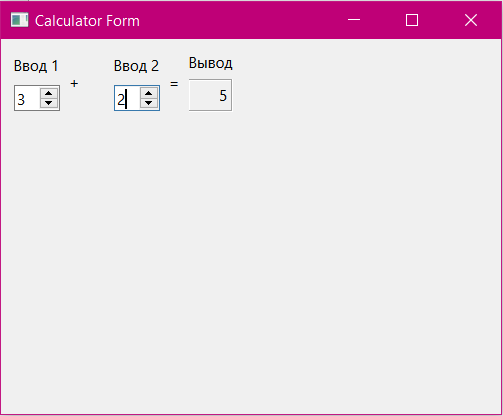
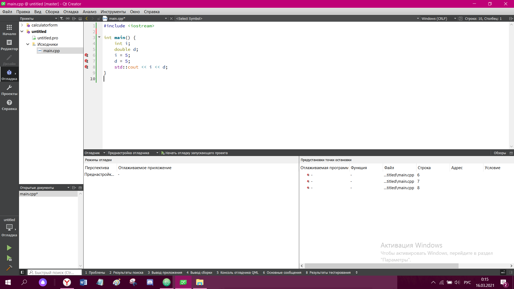

МИНИСТЕРСТВО НАУКИ  И ВЫСШЕГО ОБРАЗОВАНИЯ РОССИЙСКОЙ ФЕДЕРАЦИИ 
Федеральное государственное автономное образовательное учреждение высшего образования 
"КРЫМСКИЙ ФЕДЕРАЛЬНЫЙ УНИВЕРСИТЕТ им. В. И. ВЕРНАДСКОГО" 
ФИЗИКО-ТЕХНИЧЕСКИЙ ИНСТИТУТ 
Кафедра компьютерной инженерии и моделирования

 
<h3 align="center">Отчёт по лабораторной работе № 4  по дисциплине "Программирование"</h3>
  

студента 1 курса группы ИВТ-б-о-202(1) 
Емельянович Карина Руслановна 
направления подготовки 09.03.01 "Информатика и вычислительная техника"

  
<table>
<tr><td>Научный руководитель  старший преподаватель кафедры  компьютерной инженерии и моделирования</td>
<td>(оценка)</td>
<td>Чабанов В.В.</td>
</tr>
</table>
  

Симферополь, 2021

<h2> Постановка задачи: </h2>
Настроить рабочее окружение, для разработки программного обеспечения при помощи Qt и IDE Qt Creator, а также изучить базовые возможности данного фреймворка.

<h2> Цель работы:</h2>
1.  Установить фреймворк Qt;
2.  Изучить основные возможности создания и отладки программ в IDE Qt Creator.

<h2>Выполнение работы:</h2>

### Задание 1 ####
В ходе работы, была загружена последняя версия QT с официального сайта. В процессе установки была выбрана версия `MinGW 8.1.0` и `QT 6.0.1`.

Также был отредактирован проект-пример "Calculator Form Example": был заменен текст Input 1", "Input 2", "Output" на "Ввод 1", "Ввод 2" и "Вывод" соответственно (рис. 1)

  

 Рисунок 1 - Измененные названия параметров.

### Задание 2 ###
#### Вопросы: ####
1. Как изменить цветовую схему (оформление) среды?
2. Как закомментировать/раскомментировать блок кода средствами Qt Creator? Имеется ввиду комбинация клавиш или пункт меню.
3. Как открыть в проводнике Windows папку с проектом средствами Qt Creator?
4. Какое расширение файла-проекта используется Qt Creator? Может быть несколько ответов.
5. Как запустить код без отладки?
6. Как запустить код в режиме отладки?
7. Как установить/убрать точку останова (breakpoint)?

#### Ответы: ####
1. Инструменты-Параметры-Интерфейс-Среда-Тема
2. Правка-Дополнительно-Закомментировать или Ctrl+/
3. В режиме редактирования клик правой кнопкой мышки на папке - Показать в проводнике
4. pro
5. Ctrl+r
6. F5
7. левой кнопкой мышки кликнуть немного левее номера строки.

### Задание 3 ###

Было создано консольное приложение без Qt.Изменила содержимое main.cpp, также установила точки останова в 6,7,8 строках (Рис. 2) и по шагу проверяем значения переменных.

 

 Рисунок 2 - Точки останова в Qt Creator. 
  

* В 6 строке переменные i и d равны: i = 0, d = 6.4141365369552398e-372;
* В 7 строке переменные i и d равны: i = 5, d = 6.4141365369552398e-372;
*  8 строке переменные i и d в 8 равны: i = 5, d = 5.

<h2> Вывод: </h2>
В ходе работы все поставленные задачи и цель были выполнены: был уставлен фреймворк Qt Creator и ознакомление с интерфейсом программы;создано консольное приложение без Qt.
